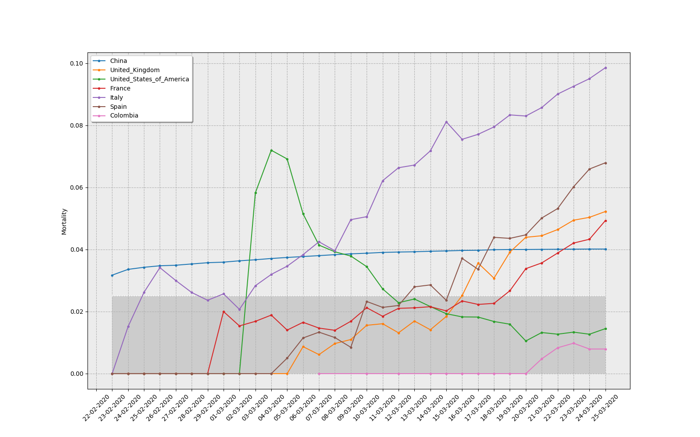

## COVID-19 plot builder

This algorithm downloads daily updated data from the [European Centre for Disease Prevention and Control](https://www.ecdc.europa.eu/en) and build plots for **Cases**, **Deaths**, and **Mortality** (Calculated with the former two).

## Getting started

To use this code run `python covid19.py`. Countries that appear in the plots can be modified in `covid19.py`:

```
# Countries to plot
countries = ['Colombia',
             'Spain',
             'Italy',
             'France',
             'United_States_of_America',
             'United_Kingdom',
             'China']
```

Plots are saved in `plots/` folder as PNG files.

## Mortality plot (updated 03/25/2020)


